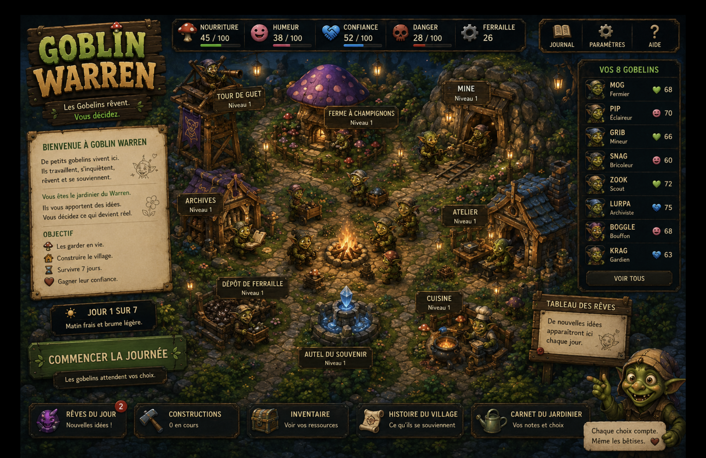

# WARREN HOME — north-star spec V0 (anchored 2026-07-06)

```
CLAIM_TYPE: design_reference
AUTHORITY: false
STATUS: PROPOSED
NOT_LEDGER: true
NOT_KERNEL: true
NOT_CANON: true
```



> **Membrane note.** This image is AI-generated concept art — the locked
> visual north star for the Warren game home. It is **not a screenshot**,
> not a witness, and not a claim of shipped state. Any implementation in
> `apps/goblin-warren/` must be **procedural (Canvas + CSS, no external
> image assets)** per the canonical-cockpit law. concept ⊬ shipped game ·
> render ⊬ reality · CONQUEST ⊬ ADMITTED.

---

## 1. Layout grammar (extract, resolution-independent)

```
┌────────────┬──────────── top stat bar ────────────┬───────────┐
│ title      │ 🍄food ☺mood 🤝trust ☠danger ⚙scrap │ 📖 ⚙ ?    │
├────────────┤                                      ├───────────┤
│ welcome/   │                                      │ roster    │
│ objective  │        village viewport              │ 8 goblins │
│ scroll     │   (buildings Niveau N, walkers,      │ role+stat │
│            │    campfire center, lantern glow)    │ VOIR TOUS │
│ day banner │                                      ├───────────┤
│ START DAY  │                                      │ dream     │
│            │                                      │ board sign│
├────────────┴──────────────────────────────────────┴───────────┤
│ 💤rêves(n) 🔨constructions 📦inventaire 📜histoire 🪴carnet    │
└────────────────────────────────────────────────────────────────┘
```

Copy locked (FR): tagline **« Les Gobelins rêvent. Vous décidez. »** ·
footer **« Chaque choix compte. Même les bêtises. ❤ »** ·
objective quartet: *les garder en vie · construire le village ·
survivre 7 jours · gagner leur confiance*.

Buildings (all « Niveau 1 » at start): Tour de Guet · Ferme à Champignons ·
Mine · Archives · Atelier · Dépôt de Ferraille · Cuisine ·
**Autel du Souvenir** (center-south, fountain-crystal).

Roster grammar: NAME · role · one stat chip (❤ vie / ☺ humeur / 🤝 confiance).
Concept cast: MOG fermier · PIP éclaireur · GRIB mineur · SNAG bricoleur ·
ZOOK scout · LURPA archiviste · BOGGLE bouffon · KRAG gardien.

## 2. Organ wiring (the game IS the membrane)

| Surface element | Live HELEN organ (implementation target) |
|---|---|
| Tableau des Rêves / « Rêves du Jour (n) » | outbox packets · badge = `ci_outbox_guard.count_unconsumed()` |
| Carnet du Jardinier | `temple/autoresearch/consumption_log.ndjson` (operator pen, hash-chained) |
| Histoire du Village | replay of pen marks — memory of how decisions became admissible |
| Autel du Souvenir | ledger reverence object — **display only, no write control on surface** |
| « Commencer la journée » | scanner dry-run (crossing-detection V2); fresh crossings arrive as dreams |
| Confiance meter | earned from marks/replay — never set directly |
| 8 goblins | proposal roles — none carries a stamp; goblin guides, audits, asks, never judges |

Hard invariants carried over: surface has **no admit control** ·
garden mark ⊬ kernel admission · dream ⊬ claim · NPC proposes ⊬ admits ·
ledger sleeps unless operator routes through the admissible bridge.

## 3. Relation to existing surfaces (seam table extension)

- `apps/goblin-warren/warren_town.html` — canonical cockpit (inspector lens).
  WARREN HOME is the **player-facing shell** that would sit in front of it;
  it does not replace the cockpit and must obey the same no-external-assets law.
- `temple/gardens/goblin_garden_conquest/warren-town.html` — garden sketch, unchanged.
- `warren-home-concept.png` — this reference. Concept art only.

## 4. Next slice (not started)

GO WARREN_HOME_V1 — procedural home screen in `apps/goblin-warren/`,
wired to the live organs per §2. Acceptance: no external assets ·
no admission language · badge/carnet/histoire read real files ·
tests for "surface cannot mark" (mirrors TRIAGE CANNOT CONSUME).

NO CLAIM · NO SHIP · NO ADMISSION · ANCHOR ONLY
